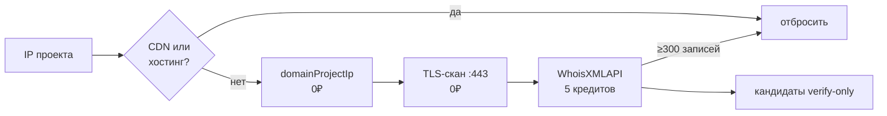

# Reverse IP: поиск доменов на хосте

Продолжение §6 `related-domain-discovery.html` — разбор цены и вариантов реализации.

## Итог одной строкой

Свой сборщик вместо API писать не стоит: reverse IP у WhoisXMLAPI стоит ~$0.005 за IP,
экономить нечего, а покрытие собственного скана заведомо у́же. Свой TLS-скан имеет смысл
**в дополнение** — он даёт то, чего нет в пассивных базах: состояние хоста прямо сейчас.

<div class="note">
Цифры ниже порядковые: точный прайс DRS отдаётся только из личного кабинета, при внедрении сверить.
</div>

## Что есть в коде сейчас

Reverse IP как источник новых доменов не реализован нигде. Что есть похожего:

| Где | Что делает | Почему это не reverse IP |
|---|---|---|
| `monitoring-kit/src/modules/dns-utils/dns-utils.service.ts:22` | `dns.Resolver.reverse(ip)` в `getDomainsByIp()` | это **PTR**: одно-два технических имени хостера (`vps-12345.timeweb.ru`), а не список сайтов |
| `domainator` → `getIPsWithLightDomains()` | группирует «IP → домены» из таблицы `domainProjectIp` | только по доменам, уже лежащим в базе; новых соседей не открывает |
| `hidden-domains/…/reverse-whois-manager.service.ts` | reverse **WHOIS** через domainator → whoisxmlapi | другой селектор (org), не IP |

## Как reverse IP устроен

DNS обратного индекса `IP → все домены` не содержит: зона `in-addr.arpa` хранит обычно одну
PTR-запись, и ставит её хостер, а не владелец сайта. Поэтому список доменов на хосте всегда
берётся из внешних баз, наполненных пассивным DNS и сканами интернета:

- **Passive DNS / reverse-IP API** — SecurityTrails, WhoisXMLAPI Reverse IP, ViewDNS, Netlas (лучшее покрытие .ru/.рф).
- **Сканеры портов с баннерами** — Shodan, Censys: домены достаются из TLS-сертификата на `IP:443`.
- **Своими руками** — скан 443 по IP и чтение `subject`/SAN; либо crt.sh по имени → резолв найденных имён.

```
example.ru → A 95.163.x.x → reverse-IP → [ shop.example.ru, blog-company.ru, cdn.other.com, ... ]
```

## Цена у WhoisXMLAPI

Reverse IP API входит в тот же **Domain Research Suite**, что и наш reverse-whois: тот же ключ
`WHOIS_API_KEY`, **тот же общий баланс DRS-кредитов**. Отдельная подписка не нужна.

| Продукт | Кредитов за запрос |
|---|---|
| Reverse WHOIS (используем сейчас, `mode: 'purchase'`) | 1 |
| **Reverse IP**, `includeAdditionalChecks=0` | **5** |
| Reverse IP с wildcard/activeness-проверками, `=1` | 7 |
| WHOIS History (выпилен в FB-728) | 50 |

```ts
const res = await fetch(
  `https://reverse-ip.whoisxmlapi.com/api/v1?apiKey=${key}&ip=${ip}&from=${cursor}`,
);
const { result, size } = await res.json();
if (size >= 300) markShared(ip); // жирный IP — дальше не платим
```

### Ловушка: общий пул кредитов

<div class="warn">
При <code>credits === 0</code> крон <code>notifyForManyTokens</code> выставляет
<code>_reverseWhoisExhausted = true</code> — <b>reverse-whois выключается целиком</b>.
Reverse IP по 5 кредитов за запрос способен выесть кредиты основного сценария.
</div>

### Бесплатный побочный эффект пагинации

«Жирность» IP видна с первой страницы: вернулось 300 записей и курсор → шаред/CDN → дальше не
платим и IP выбрасываем. Один запрос даёт и данные, и фильтр плотности.

## Свой сборщик: что работает, что нет

<div class="cards">
  <div class="card"><h4>CT-логи (crt.sh)</h4>Индекс по имени, не по IP. Другой пивот: сертификаты → домены → резолв.</div>
  <div class="card"><h4>TLS-скан IP:443</h4>Бесплатно и свежо, но при SNI виден только дефолтный vhost.</div>
  <div class="card"><h4>Свой passive DNS</h4>Dataset-задача на годы: Rapid7 FDNS закрыт, OpenINTEL под соглашением.</div>
  <div class="card"><h4>domainProjectIp</h4>Бесплатный reverse IP в границах нашей базы — верификатор кандидатов.</div>
</div>

> Reverse IP — не самостоятельный оракул, а слабый сигнал. Кандидаты идут в граф как
> `verify-only`, вес обратно пропорционален плотности IP.

## Рекомендуемая схема

По возрастанию цены, каждый следующий шаг работает по остатку от предыдущего:



1. **Внутренний индекс `domainProjectIp`** по всем проектам — 0₽, данные уже есть.
2. **TLS-скан `IP:443` + SAN** по IP-адресам проекта — 0₽, точный сигнал на выделенных хостах.
3. **WhoisXMLAPI Reverse IP точечно** — только по IP, прошедшим фильтр CDN/хостинг-диапазонов.
4. **Netlas** — если понадобится покрытие .ru/.рф лучше, чем у WhoisXMLAPI.

<div class="ok">
Шаги 1–2 уже можно делать: данные и сканер есть, денег не стоят.
</div>

## Открытые вопросы

- Сверить реальный курс DRS-кредита и остаток в кабинете перед бюджетированием.
- Откуда брать список CDN/хостинг-диапазонов для фильтра до запроса.
- Нужен ли отдельный лимит кредитов на reverse IP, чтобы не гасить reverse-whois.

Быстрый переход к поиску на индексе — <kbd>⌘</kbd> <kbd>K</kbd>.

## Источники

- [Reverse IP API — pricing](https://reverse-ip.whoisxmlapi.com/api/pricing)
- [Reverse IP API — making requests](https://reverse-ip.whoisxmlapi.com/api/documentation/making-requests)
- [Domain Research Suite — pricing](https://drs.whoisxmlapi.com/pricing)
