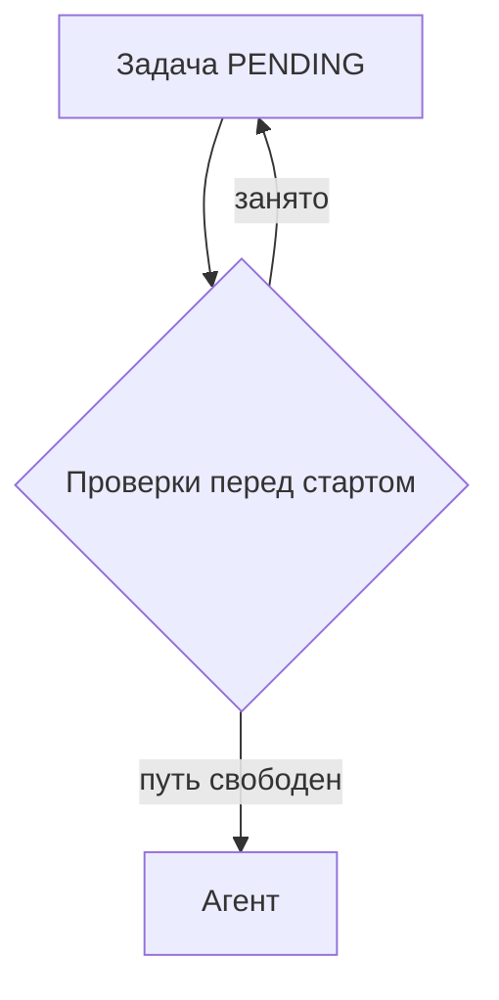

# publish-note

Заметка = markdown-файл. Скрипт отправляет его POST-запросом на сервис
[notes](https://notes.kaidstor.ru) (репозиторий `~/Projects/own/notes`), сервер рендерит
разметку и отдаёт страницу по `{домен}/{uuid}`. Страницы публичны по ссылке,
индекс с поиском — под basic-auth.

Токен **никогда** не передаётся аргументом: скрипт читает `NOTES_PUBLISH_TOKEN`
из окружения, поэтому запускается через `sec run notes`.

## Шаги

1. **Собери markdown.** Заголовок — либо `title:` во frontmatter, либо первый `# H1`
   (он уйдёт в шапку страницы и будет убран из тела, дублировать не нужно).
   Проставь теги по соглашению ниже — без них заметку потом не найти.
2. **Покажи локально, если правки в вёрстке или заметка важная:**
   ```bash
   cd ~/Projects/own/notes && bun run start    # http://localhost:3000
   sec run notes -- bun ~/.claude/skills/publish-note/scripts/publish.ts --local путь/к/note.md
   ```
   Скрипт напечатает локальный URL — его и дай пользователю на просмотр.
3. **Опубликуй:**
   ```bash
   sec run notes -- bun ~/.claude/skills/publish-note/scripts/publish.ts путь/к/note.md --pin
   ```
   В stdout — только URL (удобно копировать), в stderr — заголовок и uuid.
4. **Отдай ссылку пользователю.** Публикация — внешнее действие: если пользователь
   явно не просил публиковать, сначала спроси.

## Теги: обязательное соглашение

**Если заметка про конкретный сервис — первым тегом идёт имя сервиса**, ровно как
называется его папка/репозиторий: `hidden-domains`, `whois`, `domainator`, `recon-front`,
`notes`. Дальше — тематические теги (`recon`, `инфра`, `деплой`, `postgres`).

Если сервиса нет (инструмент, редактор, личный конфиг) — первым тегом имя инструмента
в том же виде, в каком его гуглят: `zed`, `claude-code`, `raycast`, `ghostty`.

```yaml
---
title: Reverse IP: поиск доменов на хосте
tags: hidden-domains, recon, whois
---
```

Теги входят в поисковый индекс наравне с текстом, поэтому `--list hidden-domains`
отдаёт все заметки по сервису. Без сервисного тега заметка теряется в общем списке —
не публикуй сервисные заметки без него.

## Где держать исходник

Публикация с `--pin` дописывает `uuid:`/`url:` в тот файл, который публикуешь, — значит
файл должен пережить сессию, иначе следующая публикация заведёт новую страницу.

- Заметка выросла из документа репозитория → исходник остаётся в репозитории (см. ниже).
- Заметка ни к какому репозиторию не привязана (инструмент, личный конфиг, разбор
  инцидента) → класть в `~/.claude/notes/<slug>.md`. **Не в scratchpad сессии** — он
  временный, и `--pin` вместе с ним потеряется.

## Ссылки в репозитории

Заметки, выросшие из репозиторного документа, должны быть findable из самого репозитория:

1. Публикуй такой документ **с `--pin`** — скрипт допишет в его frontmatter `uuid:` и `url:`.
   Дальше ссылка ищется обычным грепом (`rg 'notes.kaidstor.ru' docs/`), а повторная
   публикация обновляет ту же страницу, не плодя новых.
2. Если в репозитории есть индекс документации (`docs/README.md`, раздел в корневом
   `README.md`) — добавь туда строку со ссылкой.

```markdown
---
url: https://notes.kaidstor.ru/0f0f9d4c-2b1e-4a7e-9d3f-6a1c8e2b4d51
uuid: 0f0f9d4c-2b1e-4a7e-9d3f-6a1c8e2b4d51
title: Reverse IP: поиск доменов на хосте
tags: hidden-domains, recon
---
```

## Для агента: чтение опубликованного

- `GET {url}/raw` — исходный markdown заметки, **без авторизации**. Это основной способ
  прочитать чужую/старую заметку: `curl -s https://notes.kaidstor.ru/<uuid>/raw`.
  Страница по `{url}` — это уже отрендеренный HTML, парсить его не надо.
- `--list [запрос]` печатает по строке на заметку: `<uuid>  <дата>  <заголовок>` —
  режется `cut` без парсинга JSON.
- При публикации в **stdout** уходит только URL (удобно подставлять в переменную),
  заголовок и uuid — в stderr.

```bash
# все заметки сервиса → исходники
sec run notes -- bun ~/.claude/skills/publish-note/scripts/publish.ts --list hidden-domains \
  | cut -d' ' -f1 \
  | xargs -I{} curl -s https://notes.kaidstor.ru/{}/raw
```

Здесь `cut`, а не `awk` с позиционным полем, намеренно: при вызове скилла с
аргументами позиционные подстановки (доллар + цифра) в тексте SKILL.md заменяются
словами из этих аргументов, и пример приезжает к агенту уже сломанным — вместо
номера поля в команде оказывается случайное слово из запроса пользователя. В
примерах внутри скилла таких подстановок быть не должно, даже в пояснениях.

## Флаги

| Флаг | Смысл |
| --- | --- |
| `--local` | публиковать на `http://localhost:3000` вместо прода |
| `--host <url>` | произвольный адрес сервиса |
| `--title <str>` | заголовок в обход frontmatter/H1 |
| `--tags a,b` | теги (видны в индексе и в шапке страницы) |
| `--uuid <uuid>` | обновить конкретную страницу |
| `--pin` | дописать `uuid:` и `url:` во frontmatter файла — следующая публикация обновит ту же страницу, а ссылка останется в репозитории |
| `--list [запрос]` | что уже опубликовано (нужны `NOTES_USER`/`NOTES_PASSWORD`) |
| `--delete <uuid>` | удалить заметку |

## Что доступно в markdown

GFM: таблицы, списки, цитаты, код с языковым бейджем и панелью «перенос / копировать»
по наведению (длинные строки переносятся по умолчанию). Плюс **сырые HTML-блоки** —
рендерер пропускает их как есть, под них есть готовые классы:

```html
<div class="note">Синяя врезка: важный контекст.</div>
<div class="warn">Жёлтая: грабли и предупреждения.</div>
<div class="ok">Зелёная: сделано / работает.</div>

<div class="cards">
  <div class="card"><h4>Заголовок</h4>Карточка в сетке, переносится по ширине.</div>
</div>

Клавиши: <kbd>⌘</kbd> <kbd>K</kbd>
```

Заголовки `##`/`###` автоматически собираются в оглавление справа (на экранах от 1080px).

### Схемы mermaid

Блок ```` ```mermaid ```` рисуется как диаграмма — так же, как в артефактах Claude, где
mermaid поддержан нативно (там ещё и `<pre class="mermaid">` в HTML). Не надо ни картинок,
ни внешних сервисов: сохраняем исходник схемы в markdown, он же остаётся в `/raw` и
правится текстом.

````markdown

````

Как это выглядит на странице: врезка 16:10 со вписанной схемой (страницу не растягивает
даже очень высокий флоучарт), в углу панель — отдалить, приблизить, вписать, во весь экран.
Схему можно двигать мышью и приближать колесом с Ctrl прямо во врезке, двойной клик
возвращает вписанный вид. Полноэкранный просмотрщик — то же самое плюс `1:1`, проценты и
настоящий fullscreen.

Грабли:

- **Не ставить `<br/>` в подписях узлов.** Часть рендереров их выбрасывает, и соседние слова
  склеиваются («тик 1 мин» + «или кнопка» → «минили кнопка»). Писать подпись одной строкой,
  перенос mermaid сделает сам.
- Подписи длиной в предложение раздувают схему: детали лучше вынести в текст рядом.
- Бандл mermaid подключается только на страницах со схемой; если он не загрузился, вместо
  диаграммы виден её исходник — страница остаётся читаемой.

## Примеры

- «опубликуй эту доку» → `publish.ts docs/reverse-ip-discovery.md --pin` → отдать URL.
- «обнови ту заметку про traefik» → если в файле есть `uuid:` во frontmatter, достаточно
  повторить публикацию тем же файлом; иначе `--uuid <uuid>`.
- «что там уже опубликовано» → `--list`, при необходимости с запросом: `--list traefik`.

## Грабли

- Публикация без `--pin` каждый раз создаёт **новую** страницу с новым uuid. Для
  документов, которые будут обновляться, `--pin` обязателен.
- Поиск идёт по заголовку, тегам и тексту — но подстрокой, а не по «полю тега».
  Тег `whois` найдётся и в заметке, где это слово просто встречается в тексте.
  Сервисные теги стоит держать узнаваемыми (`hidden-domains`, а не `домены`).
- `sec run notes` подставляет весь проект `notes` (токен + basic-auth) — отдельные
  `sec get` не нужны, значения не должны попадать в вывод и историю.
- Сервер на проде отказывается стартовать без `NOTES_USER`, `NOTES_PASSWORD`,
  `NOTES_PUBLISH_TOKEN` — если healthcheck молчит, смотри `docker logs notes`.
- Индекс и поиск закрыты basic-auth, страницы по uuid — нет. Не публикуй туда то,
  что не должно утечь по ссылке.
